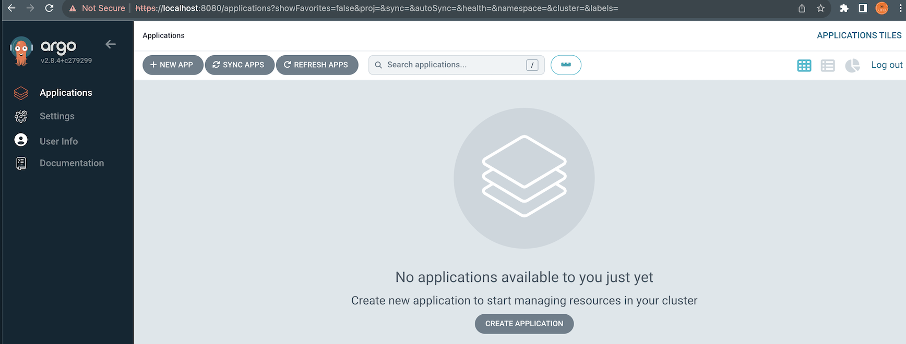
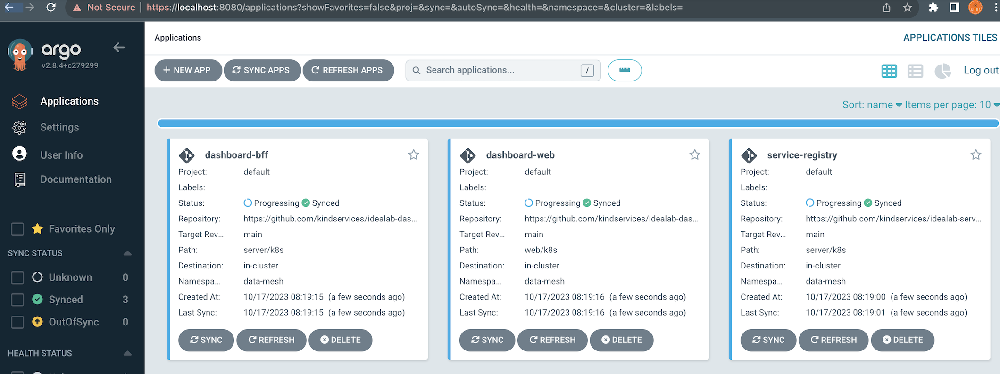

# Running

You can run the data-mesh locally, or easily port it to your own kubenetes cluster in whichever cloud you use.

Note: Our repos use [Makefile](https://opensource.com/article/18/8/what-how-makefile)s as a means to build.

## Running Locally

Our data-mesh is based on kubenetes and ArgoCD. 

To get started with those technologies, you can clone our [kindservices/local-kubernetes repo](https://github.com/kindservices/local-kubernetes):
```bash
git clone https://github.com/kindservices/local-kubernetes.git && cd local-kubernetes

# install Kind (kubernetes in docker), k9s and argocd
make install

# port-forward argocd UI to localhost and login so the 'argocd' command works from your command line
make login
```

Once running, you should have any empty ArgoCD instance locally:




# Installing the components

You can then clone each separate component, which knows how to install itself using `argocd`:

```bash
# if you're using local kubernetes 
git clone https://github.com/kindservices/local-kubernetes.git 
pushd ./local-kubernetes
# if already installed this should just have no effect
make install
make login
popd

git clone https://github.com/kindservices/datamesh-service-registry.git && ./datamesh-service-registry/install.sh
git clone https://github.com/kindservices/datamesh-dashboard.git && ./datamesh-dashboard/install.sh
git clone https://github.com/kindservices/datamesh-component-pinot.git && ./datamesh-component-pinot/install.sh
```


You should then be able to see the components installing in argo:


Or check them out in the 'data-mesh' namespace using a tool like [k9s](https://k9scli.io/):


# Cleaning up
If you want to start over/get stuck, you can wipe-out your kubernetes applications by using:
```
# delete all your data-mesh components
kubectl delete namespace data-mesh

# delete argocd itself
kubectl delete namespace argocd
```